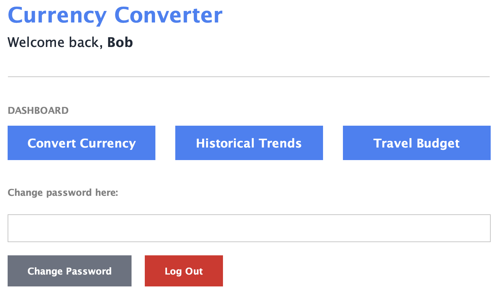
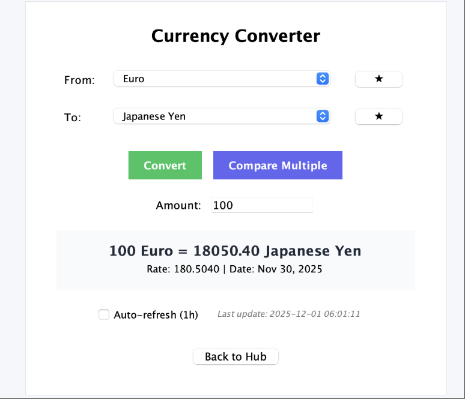
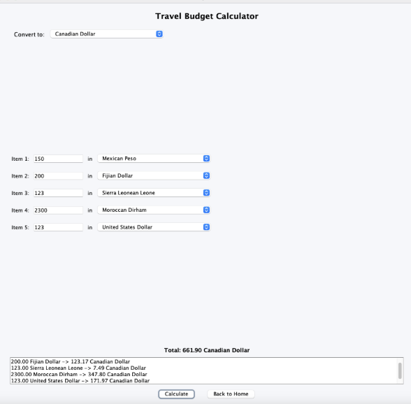
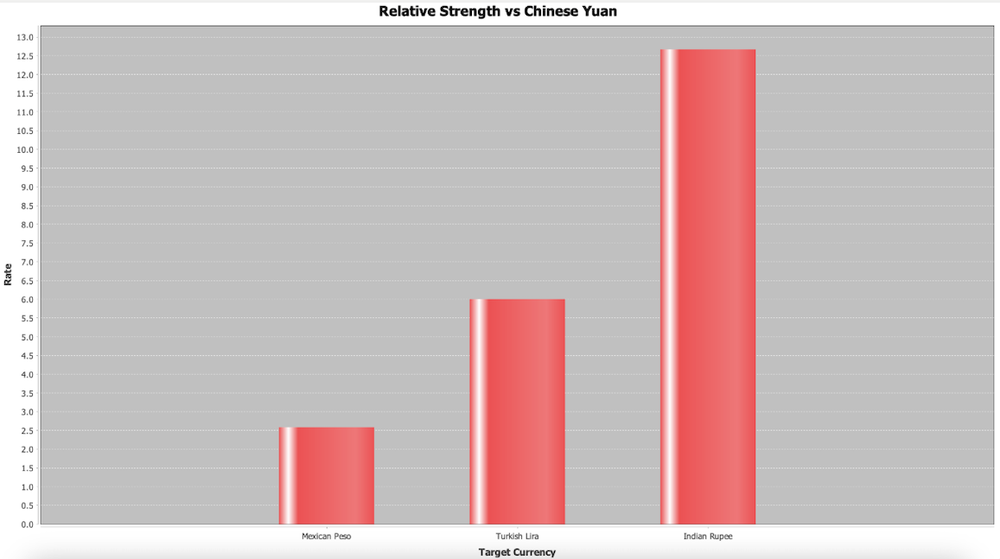
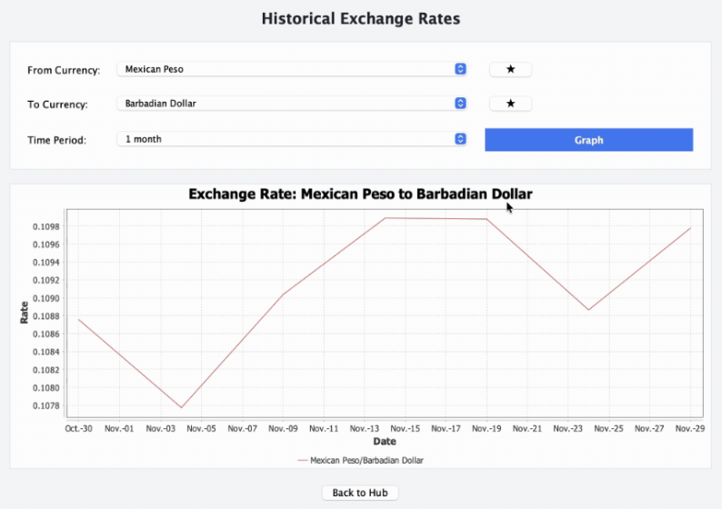

#intro Objectives, user guide, individual contribution (user story or task)

# Currency Converter & Analytics Hub


> A robust financial analysis tool built for ease of use. Strictly adheres to Clean Architecture and SOLID principles.


---

## 📖 Table of Contents
1. [Team Info](#-team-info)
2. [Introduction & Objectives](#-introduction--objectives)
3. [Main Features](#-main-features)
4. [Technology Stack](#-technology-stack)
5. [User Guide](#-user-guide)
6. [Visuals](#-visuals)
7. [Slides](#-slides)
8. [Future Plans](#-future-plans)
9. [References](#-references)

---

## 👥 Team Info

| Name                                   | GitHub Username                                      | Role / Contribution                                 |
|:---------------------------------------|:-----------------------------------------------------|:----------------------------------------------------|
| **John Sakalli (Group member 6)**      | [@jskl02](https://github.com/jskl02)                 | Use Case 1: Currency conversion                     |
| **Houssam Yaacoub (Group member 2)**   | [@houssamyaacoub](https://github.com/houssamyaacoub) | Use case 2: Historical trends                       |
| **Andy Yanxun Jiang (Group member 4)** | [@y4nxunj](https://github.com/y4nxunj)               | Use case 3: Compare strength of multiple currencies |
| **Yao Dong Chen (Group member 5)**     | [@samuder1](https://github.com/samuder1)             | Use case 4: Favourite currencies                    |
| **Junho Yoon (Group member 3)**        | [@alennchik](https://github.com/alennchik)           | Use case 5: Offline viewing using stored cache      |
| **Alen Borangali (Group member 1)**    | [@6hoyoon](https://github.com/6hoyoon)               | Use case 6: Travel budget                           |

---

## 🎯 Introduction & Objectives

Dealing with foreign exchange can be confusing due to constant market volatility. **Currency Converter** is more than just a calculator; it is a decision-support tool designed to help users visualize trends and analyze market strength before converting their money.

**Project Objectives:**
* To provide an easy-to-use interface for easily and quickly converting currencies.
* To solve the user problem of "blind conversions" by providing historical context as a clear graph (1 week to 1 year).
* To favourite multiple currencies for quick access to conversions whenever you need it.
* To visualize the strength of multiple currencies relative to one another.
* To store recent currency conversions using data persistence (cache) to retrieve data even when you're offline.
* To add a travel budget planning tool that converts multiple currencies to one base currency so you can keep track of the money you're going to spend.
* To strictly implement **Clean Architecture**, ensuring the separation of business logic (Interactors) from the UI (Swing) and Data Access (APIs).
* To demonstrate high code quality through 100% line coverage tests on core business logic and adherence to SOLID principles.

---

## 🚀 Main Features

* **💱 Real-Time Conversion:** Instantly convert currencies using live market data.
* **📈 Historical Trend Analysis:** Visualizes exchange rate performance over time (1 Week, 1 Month, 6 Months, 1 Year) using dynamic line charts.
* **📊 Multi-Currency Comparison:** Compare a base currency against up to 5 target currencies simultaneously using bar charts to identify relative strength.
* **⭐ Favorites System:** Save frequently used currencies for quick access in dropdown menus.
* **🕒 Recent History:** Stores recent history to show you conversions even when offline.
* **🛄 Travel Budgeting:** Convert multiple amounts from various currencies to another currency so that you can plan for a trip.


---

## 🛠 Technology Stack

**Core:**
* **Language:** Java 17+
* **Architecture:** Clean Architecture (Entity, Use Case, Interface Adapter, Frameworks/Drivers layers).

**Libraries & APIs:**
* **GUI Framework:** Java Swing (javax.swing).
* **Charting Library:** [JFreeChart](https://www.jfree.org/jfreechart/) (v1.5.3) - Used for Time Series and Bar Charts.
* **Web API:** [ExchangeRatesAPI.io](https://exchangeratesapi.io/) - Provides live and historical currency data.
* **Testing:** JUnit 5 to ensure 100% coverage and correctness of interactor logic

---

## 📖 User Guide

### Prerequisites
* Java Development Kit (JDK) 17 or higher.
* IntelliJ IDEA (Recommended) or Eclipse.
* Internet connection (for API calls).

### Installation
1.  **Clone the repository:**
    ```bash
    git clone https://github.com/houssamyaacoub/currency-converter/
    ```
2.  **Open in IntelliJ:**
    * Select `File` -> `Open` -> Select the project folder.
    * Right-click `pom.xml` -> `Add as Maven Project` to load dependencies (JFreeChart, etc.).
3.  **API Key Configuration:**
    * **[IMPORTANT: do this if the API request is failing (429 error)]**
    * Navigate to `src/main/java/data_access/ExchangeRateHostDAO.java` and replace the string in `API_KEY` with your own key ([exchangeratesapi.io](https://exchangeratesapi.io/)), or use one of the commented out keys above the variable.
    * Use the same key for the `API_KEY` in `src/main/java/data_access/CurrencyListDAO.java`.

### How to Run
1.  Navigate to `src/main/java/app/Main.java`.
2.  Right-click and select **Run 'Main'**.
3.  The Login screen will appear. Click "Sign Up" to create a new account, or log in if you have one.

### How to Run Tests
1.  Open the project in IntelliJ.
2.  Right-click the `src/test/java` folder.
3.  Select **Run 'All Tests'** (or **Run 'Tests in java'**) to verify the logic and coverage.

---

## 📸 Visuals

|                  **Dashboard**                  |                    **Conversion Tool**                    |
|:-----------------------------------------------:|:---------------------------------------------------------:|
| Home View | Convert View  |
|     *Dashboard to select the desired tool*      |            *Converts one currency to another*             |

|                         **Travel Budget**                          |                     **Multiple Comparisons**                     |
|:------------------------------------------------------------------:|:----------------------------------------------------------------:|
||      |
| *Budget for your trip if you plan to travel to multiple locations* | *Compare the strength of multiple currencies to a base currency* |

|            **Historical Chart**            |
|:------------------------------------------:|
|  |
|     *Historical trend of two currencies*      |
---

## 📑 Slides

* **Presentation Slides:** [Link to Google Slides for more detailed overview](https://docs.google.com/presentation/d/1FgKiReBkfyqsdm5BSItoGI-Ow1cnmr0tFMOT05fml74/edit?usp=drive_link)

---

## 🚀 Future Plans

* **📉 Offline Caching:** Implement a local database (SQLite) to cache historical graph data, allowing the app to show trends even without an internet connection.
* **₿ Crypto Support:** Extend the currency list to support cryptocurrency symbols (BTC, ETH).
* **📱 Web/Mobile Migration:** Since our Business Logic (Interactors) is pure Java and isolated from Swing, we plan to migrate the frontend to a Web Framework (Spring Boot + React) while reusing most of our backend code.
* **🦾 Accessibility:** No app is complete without taking steps towards better accessibility. We plan to add options to increase font size, colour contrast, and even take user feedback for more features.

---

## 📚 References

1. **Exchange Rate API:** [ExchangeRatesAPI.io Documentation](https://exchangeratesapi.io/documentation/)
2. **JFreeChart:** [JFree.org](https://www.jfree.org/jfreechart/)
3. **University of Toronto:** CSC207 course material for providing the user management login infrastructure.